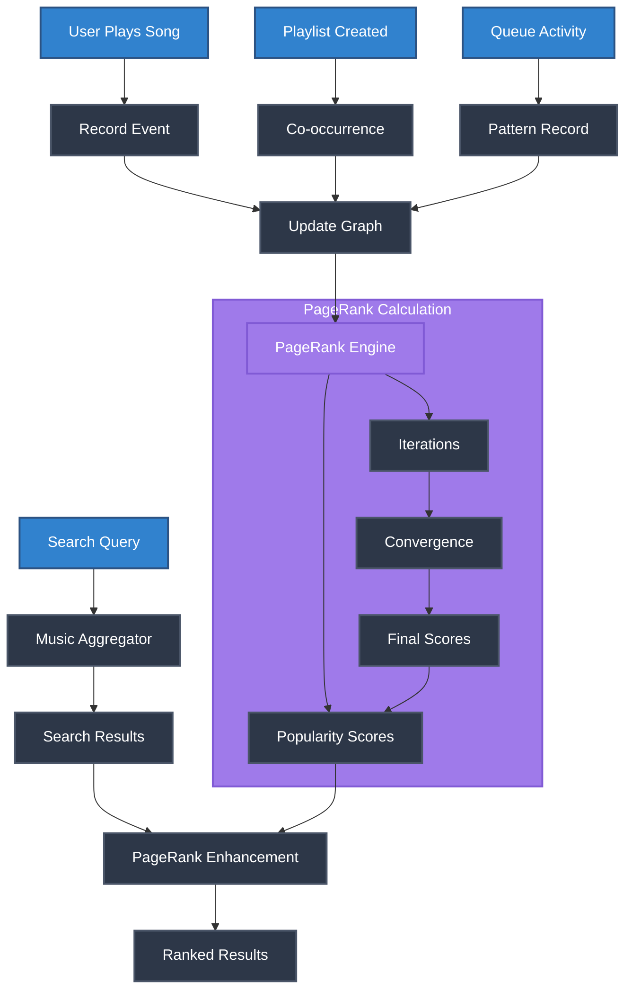

# Discord Everything Bot

A comprehensive Discord bot offering music streaming, weather information, entertainment features, and utilities. Features advanced AI-powered PageRank recommendations, Spotify OAuth integration, and intelligent multi-source content aggregation.

## Features Overview

### Music & Entertainment System
- Multi-source streaming from Spotify, YouTube, and SoundCloud with AI-powered recommendations
- Interactive entertainment including memes, jokes, and Magic 8-ball predictions

### Weather & Information Services
- Real-time weather data for any global location with detailed forecasts
- Comprehensive information retrieval and utility functions

### PageRank for Streaming Search
- PageRank algorithm learns from user behavior to improve content recommendations
- Community-driven discovery through interaction analysis and graph relationships

### Advanced Integrations
- Spotify OAuth for personal account control and playlist management
- Modern slash command interface with comprehensive help and monitoring systems

## Installation and Configuration

### Prerequisites
- Node.js version 16.0 or higher
- Discord Developer Application with bot token
- Spotify Developer Application (for enhanced features)
- OpenWeather API key (optional, for weather functionality)

### Installation Process

1. **Repository Setup**
   ```bash
   git clone <repository-url>
   cd goges_memebot
   npm install
   ```

2. **Environment Configuration**
   Create a `config.env` file in the root directory with the following variables:
   ```env
   # Discord Configuration
   DISCORD_TOKEN=your_discord_bot_token
   
   # Spotify OAuth Configuration
   SPOTIFY_CLIENT_ID=your_spotify_client_id
   SPOTIFY_CLIENT_SECRET=your_spotify_client_secret
   SPOTIFY_REDIRECT_URI=https://your-domain.workers.dev/spotify/callback
   
   # Weather API Configuration (Optional)
   WEATHER_API_KEY=your_openweather_api_key
   
   # Debug Configuration (Optional)
   DEBUG_PERFORMANCE=false
   ```

3. **Spotify Developer Application Setup**
   - Navigate to the [Spotify Developer Dashboard](https://developer.spotify.com/dashboard)
   - Create a new application and obtain client credentials
   - Configure the redirect URI to match your deployment endpoint
   - Update the `SPOTIFY_REDIRECT_URI` variable in your configuration

4. **OAuth Handler Deployment**
   Deploy the OAuth handler using Cloudflare Workers:
   ```bash
   npx wrangler publish
   ```

5. **Bot Initialization**
   Start the bot instance:
   ```bash
   node replit_memebot.js
   ```

## Command Reference

### Music Commands

| Command | Description | Usage |
|---------|-------------|-------|
| `/music play <query>` | Initiate music playback with AI-enhanced search | `/music play Bohemian Rhapsody` |
| `/music search <query>` | Perform interactive song selection with ranking | `/music search The Beatles` |
| `/music stats` | Display PageRank statistics and top-ranked songs | `/music stats` |
| `/music current` | Show current playback status for Discord and Spotify | `/music current` |
| `/music pause` | Pause current playback | `/music pause` |
| `/music resume` | Resume paused playback | `/music resume` |
| `/music skip` | Skip to next track in queue | `/music skip` |
| `/music previous` | Return to previous track | `/music previous` |

### Spotify Integration Commands

| Command | Description | Usage |
|---------|-------------|-------|
| `/spotify login` | Authenticate personal Spotify account via OAuth | `/spotify login` |
| `/spotify status` | Retrieve detailed playback status information | `/spotify status` |
| `/spotify control <action>` | Execute playback control actions | `/spotify control play` |
| `/spotify devices` | Manage and view connected Spotify devices | `/spotify devices` |
| `/spotify queue <song>` | Add track to personal Spotify queue | `/spotify queue Song Title` |

### Utility Commands

| Command | Description | Usage |
|---------|-------------|-------|
| `/weather <city>` | Retrieve weather information for specified location | `/weather London` |
| `/meme` | Generate random meme content | `/meme` |
| `/joke` | Retrieve random joke content | `/joke` |
| `/8ball <question>` | Interactive prediction responses | `/8ball Will it rain today?` |
| `/ping` | Display bot status and response time | `/ping` |
| `/help` | Comprehensive command documentation | `/help` |

## PageRank Algorithm Implementation

The bot implements a sophisticated PageRank algorithm adapted for music recommendation, analyzing user behavior patterns to intelligently rank and recommend audio content.

### Algorithm Flow Overview



### System Data Flow


### Relationship Weights

The PageRank algorithm uses weighted relationships where each interaction type has a mathematical weight $w_i$:

| Relationship Type | Weight $w$ | Impact |
|-------------------|-------------|---------|
| Playlist Co-occurrence | $w = 1.0$ | Highest |
| Queue Co-occurrence | $w = 0.8$ | High |
| User Interaction | $w = 0.7$ | Medium-High |
| Artist Collaboration | $w = 0.6$ | Medium |
| Search Co-occurrence | $w = 0.5$ | Medium-Low |

### Key Features

- **Graph-based Song Relationships**: Songs are connected based on user listening patterns
- **Weighted Relationship Types**: Different interaction types have varying influence on rankings
- **Real-time Learning**: System continuously improves with user interactions
- **Performance Optimized**: Uses incremental updates and intelligent caching

### Mathematical Foundation

The algorithm uses optimized parameters: damping factor $d = 0.85$, convergence threshold $\epsilon = 0.001$, and runs for approximately $k = 46$ iterations.

For complete mathematical analysis and performance theory, see [`PAGERANK_OPTIMIZATION.md`](./PAGERANK_OPTIMIZATION.md).

## Architecture Documentation

### System Components

```
goges_memebot/
├── commands/                 # Discord command handlers
│   ├── music.js             # Music and PageRank functionality
│   ├── spotify.js           # OAuth integration commands
│   ├── weather.js           # Weather information retrieval
│   └── utilities.js         # General utility commands
├── media/                   # Music intelligence subsystem
│   ├── musicPageRank.js     # PageRank algorithm implementation
│   ├── musicAggregator.js   # Multi-source search aggregation
│   ├── spotifyUtils.js      # Spotify API with OAuth handling
│   ├── streamManager.js     # Audio streaming management
│   ├── queueManager.js      # Queue processing and management
│   └── cookieManager.js     # YouTube cookie management
├── cloudflare-worker.js     # OAuth web interface handler
├── config.env              # Environment configuration
├── package.json            # Node.js dependencies
└── replit_memebot.js       # Main application entry point
```

### Data Flow Architecture

The system processes user interactions through the following pipeline:

1. **Input Processing**: Discord commands are parsed and validated
2. **Authentication**: Spotify OAuth tokens are verified and refreshed
3. **Music Aggregation**: Multi-source search across supported platforms
4. **PageRank Enhancement**: Results are ranked using computed scores
5. **Queue Management**: Selected tracks are processed and queued
6. **Streaming**: Audio streams are established and managed
7. **Learning**: User interactions update the PageRank graph

## Deployment Configuration

### Recommended Deployment Strategy

For optimal performance and reliability, implement a hybrid deployment approach:

- **Bot Instance**: Deploy on DisCloud or similar platform for 24/7 operation
- **OAuth Handler**: Deploy on Cloudflare Workers for authentication reliability
- **Database**: Utilize local file storage with periodic backups

### Environment-Specific Configuration

#### Development Environment
```bash
# Local development with file-based storage
NODE_ENV=development
DEBUG_PERFORMANCE=true
```

#### Production Environment
```bash
# Production deployment with optimized settings
NODE_ENV=production
DEBUG_PERFORMANCE=false
```

### Security Considerations

- OAuth 2.0 tokens are securely stored and automatically refreshed
- PageRank calculations are performed asynchronously to prevent blocking
- Input validation is implemented for all user-provided data
- Rate limiting prevents API abuse and resource exhaustion
- Sensitive configuration data is isolated in environment variables

## Performance Monitoring

### Key Performance Indicators

Monitor the following metrics for optimal performance:

- **PageRank Calculation Time**: Should complete within reasonable timeframes
- **Search Response Time**: Enhanced results should not significantly impact latency
- **Memory Usage**: Graph storage should remain within acceptable limits
- **API Rate Limits**: Spotify and other services should not be exceeded

### Optimization Recommendations

1. **Graph Cleanup**: Implement regular cleanup of inactive songs and relationships
2. **Cache Management**: Monitor cache hit rates and adjust timeout values
3. **Batch Processing**: Group similar operations for improved efficiency
4. **Incremental Updates**: Prefer incremental PageRank updates over full recalculations

## Troubleshooting Guide

### Common Issues and Solutions

#### Authentication Problems
- **Issue**: "User not authenticated" errors
- **Solution**: Execute `/spotify login` command to re-authenticate

#### Device Connectivity
- **Issue**: "No active Spotify device found" 
- **Solution**: Ensure Spotify application is open and playing on target device

#### OAuth Callback Failures
- **Issue**: Authentication redirects fail
- **Solution**: Verify redirect URI configuration and Worker deployment status

#### Performance Degradation
- **Issue**: Slow search response times
- **Solution**: Increase PageRank cache timeout or force graph cleanup

### Debug Mode Configuration

Enable comprehensive logging for troubleshooting:
```env
DEBUG_PERFORMANCE=true
DEBUG_PAGERANK=true
DEBUG_OAUTH=true
```

## Contributing Guidelines

### Development Standards

1. **Code Quality**: Maintain comprehensive error handling and logging
2. **Documentation**: Update documentation for all new features
3. **Testing**: Thoroughly test PageRank functionality with sample data
4. **Performance**: Ensure changes do not negatively impact response times

### Contribution Process

1. Fork the repository and create a feature branch
2. Implement changes following established coding patterns
3. Test functionality thoroughly, especially PageRank calculations
4. Submit pull request with detailed description of changes

## Technical Specifications

### Dependencies

- **Discord.js**: Discord API interaction library
- **Spotify Web API SDK**: Official Spotify integration
- **yt-dlp**: YouTube audio extraction utility
- **Node.js**: Runtime environment (version 16+)

### Algorithm Complexity

- **Full Calculation**: $O(k \cdot N)$ for $k$ iterations over $N$ songs
- **Incremental Updates**: $O(S)$ for $S$ changed songs  
- **Search Enhancement**: $O(M)$ for $M$ results

## License and Acknowledgments

This project is released under the MIT License. The PageRank algorithm implementation is inspired by Google's original PageRank research paper.

### Technical Acknowledgments

- Google PageRank Algorithm research for music ranking methodology
- Spotify Web API for comprehensive music streaming capabilities  
- Discord.js development team for robust bot framework
- Cloudflare Workers platform for OAuth infrastructure

---

**Goge's Discord Bot** | Professional Discord Bot Solution
