# 🤖 Goge's Discord Everything Bot

A powerful, feature-rich Discord bot that handles music streaming, weather information, entertainment, and utilities. Now with **enhanced Spotify OAuth integration** and **AI-powered PageRank music recommendations**!

## ✨ Key Features

### 🎵 **Advanced Music System**
- **Multi-source streaming**: Spotify, YouTube, SoundCloud
- **Personal Spotify Integration**: OAuth-powered user authentication
- **Smart queue management** with prebuffering and fallback systems
- **AI-powered recommendations** using PageRank algorithm
- **Intelligent search ranking** that learns from user behavior

### 🎯 **PageRank Music Intelligence** (NEW!)
- **Song relationship mapping** based on user listening patterns
- **Smart search enhancement** with popularity-based ranking
- **Automatic recommendation system** for playlists and queues
- **Community-driven music discovery** through interaction analysis
- **Real-time learning** from playlist co-occurrence and queue patterns

### 🔐 **Spotify OAuth Features**
- **Personal account connection** via OAuth 2.0
- **Playback control**: Play, pause, skip, volume, shuffle
- **Device management**: View and control all your Spotify devices
- **Personal playlists**: Access your saved playlists with AI recommendations
- **Queue integration**: Add songs directly to your Spotify queue

### 🌤️ **Other Features** (Simplified)
- **Weather Information**: Real-time data for any city worldwide
- **Entertainment**: Memes, jokes, Magic 8-ball predictions
- **Utilities**: Bot monitoring, help system, modern slash commands

## 🚀 Quick Start

### Installation & Setup

1. **Clone and Install**
   ```bash
   git clone <repository-url>
   cd goges_memebot
   npm install
   ```

2. **Configure Environment**
   ```bash
   cp config.env.example config.env
   # Edit config.env with your tokens
   ```

3. **Set up Spotify OAuth**
   - Create app at [Spotify Developer Dashboard](https://developer.spotify.com/dashboard)
   - Add redirect URI: `https://gogesbot.workers.dev/spotify/callback`
   - Update `SPOTIFY_REDIRECT_URI` in `config.env`

4. **Deploy OAuth Handler**
   ```bash
   npx wrangler publish  # For Cloudflare Workers
   ```

5. **Start the Bot**
   ```bash
   node replit_memebot.js
   ```

## 📱 Core Commands

### 🎵 Music Commands

- **`/music play <query>`** - Play music with AI-enhanced search
- **`/music search <query>`** - Interactive song selection with ranking
- **`/music stats`** - View PageRank music statistics and top songs
- **`/music current`** - Show current playback (Discord + Spotify)
- **`/music pause/resume/skip/previous`** - Playback controls

### 🔐 Spotify Commands

- **`/spotify login`** - Connect your account via OAuth
- **`/spotify status`** - Detailed playback status
- **`/spotify control <action>`** - Control playback (play/pause/skip/volume)
- **`/spotify devices`** - Manage connected devices
- **`/spotify queue <song>`** - Add to personal Spotify queue

### 🎯 Other Commands (Simplified)

- **`/weather <city>`** - Weather information
- **`/meme`** - Random memes
- **`/joke`** - Dad jokes
- **`/8ball <question>`** - Magic predictions
- **`/ping`** - Bot status
- **`/help`** - Command guide

## 🧠 PageRank Music Intelligence System

The bot uses an advanced **PageRank algorithm** (inspired by Google's search ranking) to intelligently rank and recommend music based on user listening patterns and song relationships.

### How It Works

```mermaid
graph TD
    A["🎵 User Search Query"] --> B["🔍 Music Aggregator"]
    B --> C["📊 Search Results"]
    C --> D["🎯 PageRank Enhancement"]
    D --> E["✨ Enhanced Results"]
    
    F["🎵 User Plays Song"] --> G["📈 Record Play"]
    G --> H["🔗 Update Song Graph"]
    
    I["📋 Playlist Creation"] --> J["🔗 Record Co-occurrence"]
    J --> H
    
    K["🎶 Queue Interactions"] --> L["📈 Record Queue Pattern"]
    L --> H
    
    H --> M["⚡ PageRank Calculation"]
    M --> N["📊 Song Popularity Scores"]
    N --> D
    
    O["💾 Music Graph Storage"] --> H
    H --> O
    
    P["🔄 Hourly Updates"] --> M
    Q["🧹 Cleanup Old Data"] --> H
    
    subgraph "PageRank Algorithm"
        M --> R["🔄 Iterative Scoring"]
        R --> S["🎯 Convergence Check"]
        S --> T["✅ Final Scores"]
        T --> N
    end
    
    subgraph "Relationship Types"
        U["📋 Playlist Co-occurrence<br/>Weight: 1.0"]
        V["🎶 Queue Co-occurrence<br/>Weight: 0.8"]
        W["👥 Artist Collaboration<br/>Weight: 0.6"]
        X["🔍 Search Co-occurrence<br/>Weight: 0.5"]
        Y["🎵 User Interaction<br/>Weight: 0.7"]
    end
    
    style A fill:#ff9999
    style E fill:#99ff99
    style M fill:#9999ff
    style N fill:#ffff99
```



### Key Features

1. **Smart Search Ranking**: Songs gain popularity through user interactions
2. **Relationship Mapping**: Tracks connections between songs in playlists and queues
3. **Community Learning**: Algorithm improves with more user activity
4. **Automatic Updates**: Recalculates rankings hourly for optimal results
5. **Intelligent Recommendations**: Suggests related music based on listening patterns

### How Relationships Are Built

- **Playlist Co-occurrence** (Weight: 1.0): Songs in the same playlist are strongly related
- **Queue Co-occurrence** (Weight: 0.8): Songs played together in sequence
- **User Interactions** (Weight: 0.7): Individual play patterns and preferences  
- **Artist Collaborations** (Weight: 0.6): Songs by the same artist
- **Search Co-occurrence** (Weight: 0.5): Songs found together in search results

### Benefits for Users

- **Better Search Results**: Most relevant songs appear first
- **Music Discovery**: Find new songs through intelligent relationships
- **Personalized Playlists**: AI-powered recommendations based on community patterns
- **Improved Over Time**: System gets smarter with every interaction

## 🏗️ Architecture (Simplified)

### Core Components

```
├── commands/              # Discord commands
│   ├── music.js          # Music + PageRank features
│   ├── spotify.js        # OAuth integration
│   └── ...               # Other utilities
├── media/                # Music intelligence system
│   ├── musicPageRank.js  # PageRank algorithm (NEW!)
│   ├── musicAggregator.js # Enhanced multi-source search
│   ├── spotifyUtils.js   # Spotify API with OAuth
│   ├── streamManager.js  # Audio streaming
│   └── queueManager.js   # Queue management
├── cloudflare-worker.js  # OAuth web interface
└── replit_memebot.js     # Main bot entry point
```

## 🔧 Configuration

### Required Environment Variables

```env
# Discord
DISCORD_TOKEN=your_discord_bot_token

# Spotify (Enhanced features)
SPOTIFY_CLIENT_ID=your_spotify_client_id
SPOTIFY_CLIENT_SECRET=your_spotify_client_secret
SPOTIFY_REDIRECT_URI=https://your-domain.workers.dev/spotify/callback

# Weather (Optional)
WEATHER_API_KEY=your_openweather_api_key
```

## 🚀 Deployment Options (Simplified)

### Recommended: Hybrid Setup
- **Bot**: DisCloud for 24/7 operation
- **OAuth**: Cloudflare Workers for authentication
- **Best of both worlds**: Reliability + performance

### Alternative Options
- **Cloudflare Workers**: Best for OAuth reliability
- **DisCloud**: Simple bot-only deployment
- **Self-Hosted**: Full control with Node.js 16+

## 🔒 Security & Performance

- **OAuth 2.0**: Secure Spotify authentication
- **PageRank Optimization**: Efficient graph calculations
- **Auto-cleanup**: Removes old data automatically  
- **Rate Limiting**: Prevents API abuse
- **Input Validation**: Sanitized user inputs

## 🆘 Troubleshooting (Simplified)

### Common Issues & Solutions

| Issue | Solution |
|-------|----------|
| "User not authenticated" | Use `/spotify login` |
| "No active Spotify device" | Open Spotify and start playing |
| OAuth callback failures | Check redirect URI and Worker deployment |
| Search not improving | More usage needed to build PageRank data |

### Debug Mode
```env
DEBUG_PERFORMANCE=true
```

## 🤝 Contributing

1. Fork the repository
2. Create feature branch
3. Test thoroughly (especially PageRank features)
4. Submit pull request

## 📄 License

MIT License - see LICENSE file for details.

## 🙏 Acknowledgments

- **Google PageRank Algorithm** - Inspiration for music ranking system
- **Spotify Web API** - Music streaming capabilities
- **Discord.js** - Bot framework
- **Cloudflare Workers** - OAuth infrastructure

---

**Made with ❤️ by Goge | Enhanced with AI-Powered Music Intelligence** 